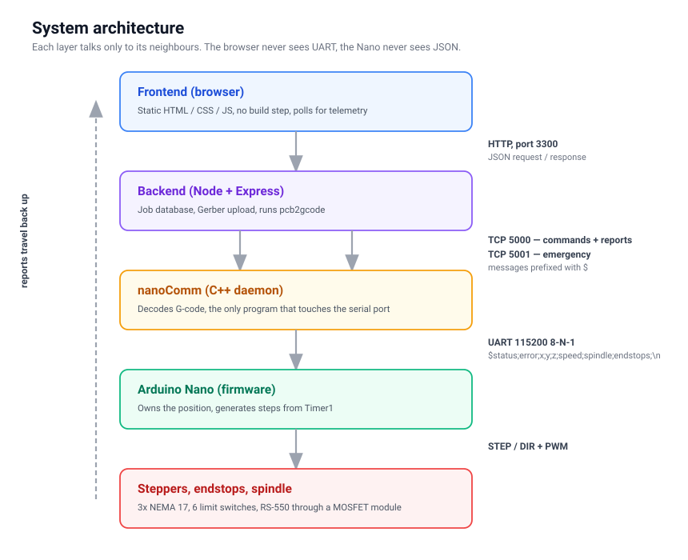

# PCB milling machine

A three-tier system that takes a Gerber file from a PCB editor and mills the
board. Browser → Node backend → C++ daemon → Arduino Nano → stepper motors.

This folder exists for the repository only. Only `webUI/` gets deployed to the
Raspberry Pi, so anything that is description rather than running code belongs
here.




## Repository map

```txt
nanoCode/            firmware for the Arduino Nano (PlatformIO)
webUI/
  backend/           Node + Express on port 3300, speaks TCP 5000/5001
  frontend/          static HTML/CSS/JS, no build step
  nanoComm/          C++ daemon, the only thing that touches UART
  database/          SQLite job list
  gerbers/           uploaded Gerber files
  gcodes/            generated G-code
  printer/           millproject = pcb2gcode configuration
  commProtocol.txt   BINDING protocol description, the source of truth
tests/nanoTest/      standalone PlatformIO project for motor testing
documentation/       this description
  pictures/          diagrams
models/              3D models of the frame
```


## Documentation

| File | What it covers |
|---|---|
| [architecture.md](architecture.md) | How the layers talk, who owns which state |
| [firmware.md](firmware.md) | Nano: pinout, timers, kinematics, speeds |
| [gcode-pipeline.md](gcode-pipeline.md) | Gerber → pcb2gcode → G-code → Nano |
| [known-issues.md](known-issues.md) | What is unfinished, what is a trap, what must be done |

Command numbers, error codes and the report format live in
`webUI/commProtocol.txt`. That file is the source of truth and is deliberately
not duplicated here, so the two cannot drift apart.


## Hardware at a glance

| Item | Value |
|---|---|
| Controller | Arduino Nano (ATmega328P) |
| Motors | NEMA 17, 200 steps/rev, drivers at half-stepping |
| X, Y | GT2 belt, 16-tooth pulley → 12.5 steps/mm |
| Z | T8 leadscrew, 2 mm pitch → 200 steps/mm |
| Work area | 75 × 95 × 25 mm |
| Spindle | RS-550, brushed, 12 V through a PWM MOSFET module |
| UART | 115200 8-N-1 |


## Running it

Order matters. The backend connects to ports 5000 and 5001 as soon as it
starts, so **nanoComm has to be running first** — otherwise the backend
reports `ECONNREFUSED` and never retries.

### 1. Firmware onto the Nano

```bash
cd nanoCode
pio run -t upload
pio device monitor -b 115200   # optional
```

### 2. C++ daemon

```bash
cd webUI/nanoComm
cmake -B cmake-build-debug -S .
cmake --build cmake-build-debug
./cmake-build-debug/nanoComm
```

The daemon starts, opens both TCP servers and then **waits for the backend to
connect** — first on 5001, then on 5000. Until that happens it just sits there.

A note on paths: the daemon runs from `cmake-build-debug/`, one level below
`webUI/`. That is why the backend sends G-code paths as
`../../gcodes/<name>.gcode`. If the build directory changes, that string in
`server.js` has to change with it.

### 3. Backend

```bash
cd webUI/backend
npm install
npm start        # listens on 3300
```

The paths in `server.js` (`../gerbers`, `../gcodes`, `../database/gcodes.db`)
are relative to the **current working directory**, not to the source file. The
backend therefore has to be started from `webUI/backend/`.

### 4. Frontend

Open `webUI/frontend/index.html` in a browser. There is no build step, and CORS
is enabled on the backend, so even `file://` works.

### 5. pcb2gcode

Must be on `PATH` — the backend invokes it through `spawn`. Verified against
version 2.5.0.

```bash
pcb2gcode --version
```


## First run

1. Power up the motors and start all three layers as above.
2. Press **HOME MIN** or **HOME MAX** in the frontend. Until the machine is
   homed, every jog is refused in nanoComm (status 1, error 3).
3. Check that the endstop panel reacts when you press a switch by hand.
4. Only then upload a Gerber and mill.
</content>
