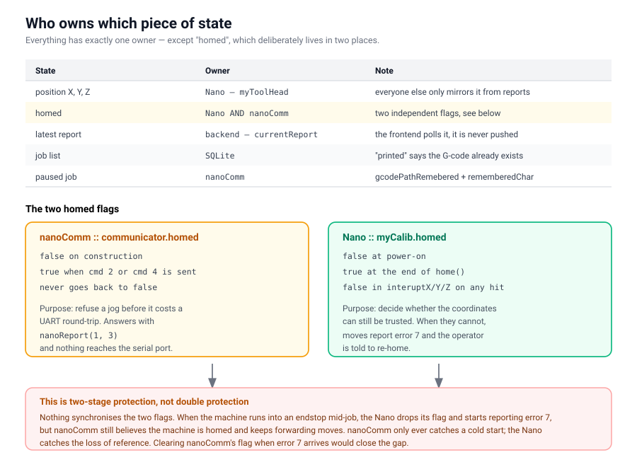
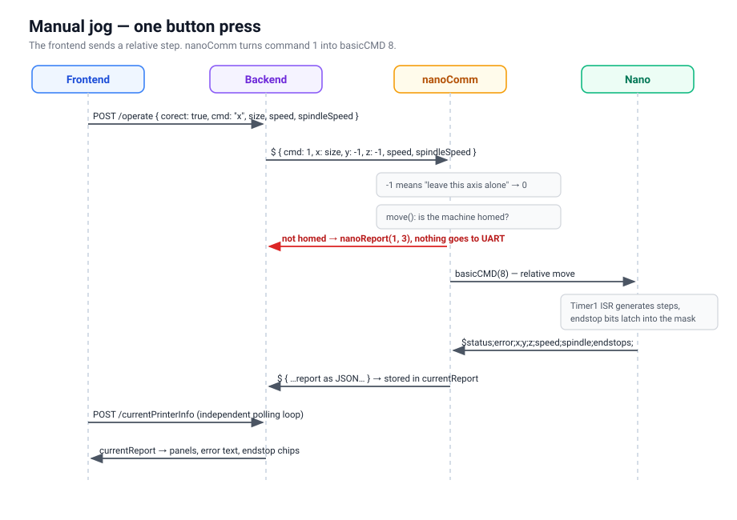

# Architecture

## The chain

```txt
browser (frontend)
    |  HTTP, JSON, port 3300
backend (Node + Express)
    |  TCP, JSON prefixed with $, ports 5000 and 5001
nanoComm (C++ daemon)
    |  UART 115200, text frame prefixed with $
Arduino Nano (firmware)
    |  STEP/DIR
stepper motors + spindle
```

Every layer talks only to its neighbours. The frontend never sees UART, the
Nano never sees JSON. The message format on both lower boundaries is described
in `webUI/commProtocol.txt`.


## Why two TCP ports

| Port | Purpose |
|---|---|
| 5000 | commands and reports, JSON, bidirectional |
| 5001 | emergency, single characters `;` (pause) and `#` (stop) |

Emergency has its own port on purpose. During a job, port 5000 is busy waiting
for a report from the Nano, and that wait can be long because `listenUART()`
blocks until the move finishes. If stop went through the same channel, it would
arrive only after there was nothing left to stop.

Be clear about what emergency actually is: **it is a software stop**. It means
"finish the current small command, then hold". The Nano does not act on it
mid-move. The real emergency stop is the hardware button on D2 (an interrupt),
which cuts motors and spindle immediately.


## Who owns which state

This is the only non-trivial part of the whole design, because **state lives in
several places at once** and those places have to agree.



| State | Lives in | Note |
|---|---|---|
| position X, Y, Z | Nano (`myToolHead`) | sole owner, everyone else mirrors it from reports |
| `homed` | Nano **and** nanoComm | two independent flags, see below |
| latest report | backend (`currentReport`) | the frontend polls it |
| job list | SQLite | `printed` says whether the G-code already exists |
| paused job | nanoComm (`gcodePathRemebered`, `rememberedChar`) | needed to resume after a pause |

### The two homed flags

The Nano has `myCalib.homed` and nanoComm has its own `communicator::homed`.
No message synchronises them; each one is set locally:

- nanoComm sets it to `true` when it sends a homing command (cmd 3 or 4), and
  never back to `false`.
- The Nano sets it to `false` every time an ISR hits an endstop.

The reason it works this way: nanoComm needs to refuse a move before it even
reaches the UART, so it does not have to wait for a report. The Nano needs to
know whether the coordinates are still trustworthy so it can raise error 7.

The consequence, which is by design: when the machine runs into an endstop, the
Nano drops its flag and starts reporting error 7, but nanoComm does not know
that and keeps forwarding moves. The protection is therefore **two-stage, not
doubled** — nanoComm catches a cold start, the Nano catches a lost reference.


## Flow: manual jog



```txt
FE   X+ button
     POST /operate { corect: true, cmd: "x", size, speed, spindleSpeed }
BE   sendCMD({ cmd: 1, x: size, y: -1, z: -1, speed, spindleSpeed })
     -> "${JSON}\n" onto socket 5000
CPP  operateCommunicator() case 1
     -1 on an axis means "do not move", converted to 0
     move() -> if !homed, stops here with report (1, 3)
     otherwise sendBasicCMD(basicCMD(8, ...))  <- cmd 8, relative move
     listenUART() waits for the report
     sendData(report) back onto 5000
BE   handleNanoLine() overwrites currentReport
FE   picks it up on the next poll of /currentPrinterInfo
```

Note that the frontend sends a **relative** step and the backend forwards it as
`cmd: 1`, but nanoComm turns that into `basicCMD(8)`. In the protocol, 1 is an
absolute move and 8 is relative. The translation happens in
`operateCommunicator()`.

### The -1 convention

`-1` means "ignore this field". It runs through the entire chain:

- the backend sends `-1` for axes that should not move
- every `basicCMD` parameter defaults to `-1`
- the firmware tests `cmd.speed == -1` by exact equality and keeps the previous
  speed on a match

So `-1` must never be "fixed up" to 0 anywhere along the way. Zero is a valid
coordinate, `-1` is not.


## Flow: milling

```txt
FE   Upload Gerber  -> POST /uploadGerber   -> webUI/gerbers/
FE   POST /newDBGcodeIns                    -> row in SQLite
FE   print button   -> POST /printGcode
BE   is printed > 0 and does the file exist?
       no  -> generateGcode(): spawn pcb2gcode with --config millproject
              check board size against 54 x 76 mm
       yes -> reuse the existing file
     sendCMD({ cmd: 3, path: "../../gcodes/<name>.gcode" })
CPP  gcodeSender()
       ping, confirm the Nano is alive
       if not homed yet -> send homing
       gcodeDecoder reads the file one command at a time
       each command -> sendBasicCMD -> listenUART -> sendData
       emergency is polled from 5001 in between
     M2 or M30 -> end of job -> spindle off + home to max
```

G-code is generated **only once**. The condition is the `printed` flag in
SQLite *and* the file existing on disk; if either is missing, it is regenerated.
The flag alone is not enough, because the file could have been deleted by hand.


## Frontend

Purely static — no framework, no build step. It keeps state in module-level
variables and gets telemetry by polling `/currentPrinterInfo`.

Error codes are turned into sentences by `errorMessages` in `index.js`. That
table is **split by status**, because the same number means different things
depending on the source — error 7 from the Nano is "endstop hit or never homed",
but from nanoComm it is "serial port is not open". When a new error code is
added, it has to go into both places: `commProtocol.txt` and `errorMessages`.


## Outdated documentation

`webUI/nanoComm/communication-cheatsheet.md` describes a design that is **no
longer in use** — communication through JSON files on disk (`readTask()`,
`doTask()`, a file queue) instead of TCP sockets. It carries a header saying so.
Today it is TCP on 5000/5001. Either delete it or keep the header, so nobody
starts building against it.
</content>
