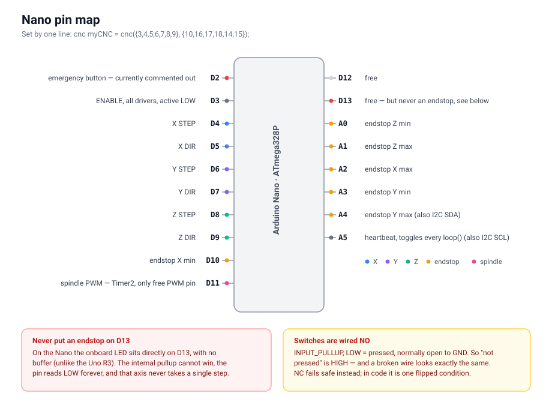
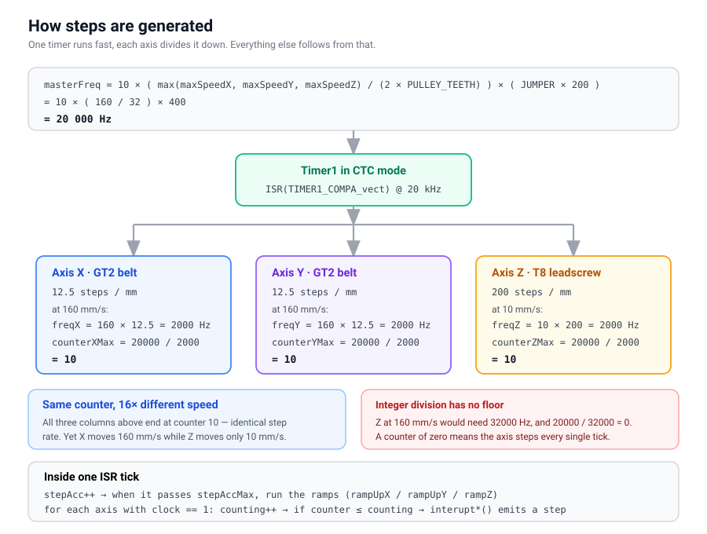
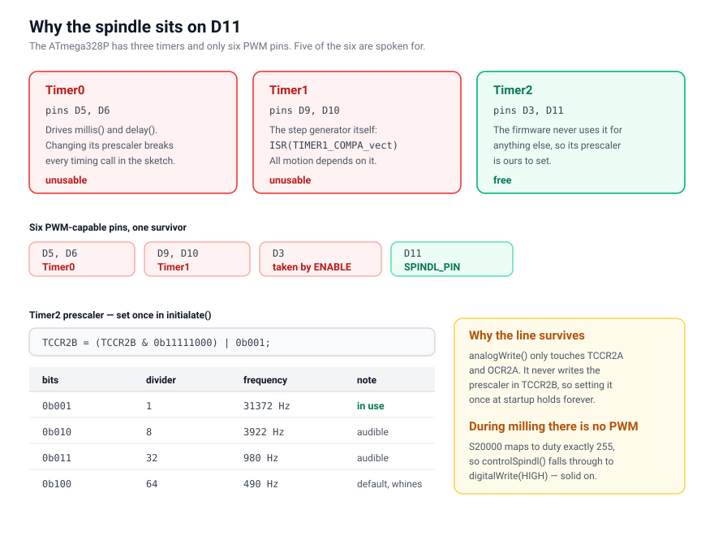

# Nano firmware

`nanoCode/src/main.cpp`, PlatformIO, board `nanoatmega328new`, `-std=gnu++17`.


## Pinout

Wiring is defined by a single line at the bottom of the file:

```cpp
cnc myCNC = cnc({3,4,5,6,7,8,9}, {10,16,17,18,14,15});
```

The first array is motors, the second endstops. `initialate()` spreads them
into `setupPins()` like this:



| Pin | Function |
|---|---|
| D2 | emergency button (hardware interrupt) — **currently commented out** |
| D3 | ENABLE for all drivers, active LOW |
| D4 / D5 | X STEP / DIR |
| D6 / D7 | Y STEP / DIR |
| D8 / D9 | Z STEP / DIR |
| D10 | endstop X min |
| D11 | spindle, PWM |
| D12, D13 | free |
| A0 / A1 | endstop Z min / Z max |
| A2 | endstop X max |
| A3 / A4 | endstop Y min / Y max |
| A5 | heartbeat, toggled on every `loop()` |

Endstops use `INPUT_PULLUP` and the firmware reads **LOW = pressed**.

Two consequences worth repeating:

**Never put an endstop on D13.** On the Nano the onboard LED is wired directly
to it, with no buffer (unlike the Uno R3). The internal pullup cannot overcome
it, the pin reads LOW permanently, and that axis stands still and never takes a
single step.

**The switches are wired NO — normally open to GND.** "Not pressed" is HIGH, so
a broken wire looks exactly like "everything is fine" and the machine silently
loses its protection. NC wiring fails in the safe direction, and in code it is
just a flipped condition in `interupt*()`.

`#include <Wire.h>` sits at the top but `Wire.begin()` is never called, so
A4/A5 remain free as GPIO. If I2C were ever enabled, it would take the Y max
endstop and the heartbeat with it.


## Constants

```cpp
#define LEAD_T8 2              // leadscrew pitch, mm per revolution
#define JUMPER 2               // driver microstepping (half step)
#define PULLEY_TEETH 16        // GT2 pulley teeth
#define MAX_X 75               // work area in mm
#define MAX_Y 95
#define MAX_Z 25
#define MAX_SPEED 160          // mm/s
#define MINIMAL_DISTANCE_STEP 25
#define MAX_ACC 150
#define START_FREQ 100
```

`MAX_SPEED` is **in millimetres per second**. That is the single most common
source of confusion in this project, because G-code works in millimetres per
minute. See [gcode-pipeline.md](gcode-pipeline.md).


## Kinematics, and why Z is nothing like X/Y

```cpp
stepLenghtGT2 = (JUMPER * 200) / (PULLEY_TEETH * 2) = 400 / 32  = 12.5 steps/mm
stepLenghtT8  = (JUMPER * 200) / LEAD_T8            = 400 / 2   = 200  steps/mm
```

**Z needs 16× more steps per millimetre than X and Y.** This is the most
important number in the firmware and it explains a lot of behaviour that looks
like a bug:

- The same speed in mm/s means a **sixteen times higher step frequency** on Z.
  Swap a motor from X to Z and it "runs faster", but that is only the same
  frequency meeting a different transmission. It is not a fault in the X axis.
- Z therefore never reaches `MAX_SPEED`. At 160 mm/s it would need 32000 Hz,
  which the motor cannot follow and which `masterFreq` cannot divide (below).
- The realistic ceiling for Z is somewhere around 10–20 mm/s. `moveZ()`
  enforces it itself.


## Step generation



### masterFreq

```cpp
long wantedMaxFreq = 10UL * (max(maxSpeedX, maxSpeedY, maxSpeedZ) / (2 * pulleyNumTeeth))
                          * (jumperDown * 200);
```

With today's values: `10 * (160 / 32) * 400 = 20000 Hz`.

Timer1 ticks at `masterFreq` and each axis **divides it down**. The factor of
ten is deliberate — it allows fractional division with better precision than
whole numbers would give.

The trap here: the formula always uses **GT2 geometry** (`2 * pulleyNumTeeth`),
even when the maximum comes from `maxSpeedZ`, which runs on a leadscrew. As
long as all three are equal it does not matter. The moment `maxSpeedZ` grows
past the others, `masterFreq` comes out wrong.

### Dividing down to axes

```cpp
counterXMax = masterFreq / freq;   // integer division!
```

`setupFreqX/Y/Z()` works out how many timer ticks pass between steps. Because
this is **integer division**:

- a frequency that is not a divisor of `masterFreq` is rounded down
- a frequency larger than `masterFreq` yields **zero**, and the axis runs away
  uncontrolled

Example for Z at 10 mm/s: `freqZ = 10 * 200 = 2000 Hz`,
`counterZMax = 20000 / 2000 = 10` exactly. That is why 10 mm/s is a good
choice — it divides evenly.

### The ISR

`ISR(TIMER1_COMPA_vect)` is the only step generator. On each tick it:

1. increments `stepAcc` and, once it passes `stepAccMax`, runs the ramps
   (`rampUpX/Y/Z`) — that is acceleration and deceleration
2. for every axis with `clockX/Y/Z == 1`, counts up `counterX/Y/Z` and emits a
   step through `interuptX/Y/Z()` when the count is reached

`interupt*()` is also where endstops are read, `homed` is set to `false`, and
the bit is OR-ed into `currentEndstopsError`.

Axes with `clock* == 0` are ignored. Because `myCNC` is a global and therefore
zeroed before its constructor runs, it is safe that `initialate()` calls
`timer1Start()` **before** `setupPins()` — the ISR is already running but moves
no axis and touches no uninitialised port. It is fragile ordering all the same,
see [known-issues.md](known-issues.md).


## Speeds and where they get clamped

Speed travels like this:

```txt
command from UART -> cmd.speed -> myToolHead.speed -> freqX/Y/Z -> counter*Max
```

The only general clamp is in `operateInstr()`:

```cpp
if (!(cmd.speed == -1) && (cmd.command != 2)) {
    if (cmd.speed > MAX_SPEED) {
        cmd.speed = MAX_SPEED;
    }
    myToolHead.speed = cmd.speed;
}
```

Two things matter about it:

**It clamps to 160 regardless of axis.** It does not care that Z cannot take
that. So `moveZ()` has a second ceiling of its own:

```cpp
if (myToolHead.speed >= 20) {
    freqZ = int(20 * myCalib.stepLenghtT8);
}
```

**`myToolHead.speed` persists.** When `speed == -1` arrives the condition fails
and the last known speed is reused. The speed from the previous command
therefore survives until something explicitly overwrites it. The frontend
accounts for this and sends a speed every time.

The variables `maxSpeedX`, `maxSpeedY` and `maxSpeedZ` exist, but they are read
**only once**, when `masterFreq` is computed. They are not used for clamping.


## Spindle

`SPINDL_PIN` is **D11**, and it is the only sensible choice:



| Timer | Pins | Who uses it |
|---|---|---|
| Timer0 | D5, D6 | `millis()`, `delay()` — touching it breaks all timing |
| Timer1 | D9, D10 | the step generator, `ISR(TIMER1_COMPA_vect)` |
| Timer2 | D3, D11 | **free**, the firmware does not otherwise use it |

Only D3, D5, D6, D9, D10 and D11 can do PWM. Of those, D5, D6, D9 and D10 are
lost to timers and D3 is taken as ENABLE. D11 is what remains.

`initialate()` changes the Timer2 prescaler:

```cpp
TCCR2B = (TCCR2B & 0b11111000) | 0b001;   // ~31 kHz instead of the default 490 Hz
```

The default 490 Hz is audible as a whine coming straight out of the motor.
Prescaler options:

| Bits | Divider | Frequency |
|---|---|---|
| `0b001` | 1 | 31372 Hz |
| `0b010` | 8 | 3922 Hz |
| `0b011` | 32 | 980 Hz |
| `0b100` | 64 | 490 Hz (default) |

The line has to stay, because `analogWrite()` only touches `TCCR2A` and
`OCR2A` — it leaves the prescaler in `TCCR2B` alone. Set it once and it holds.

### Converting rpm to duty cycle

```cpp
conversionConst = 255.0f / maxSpindlSpeed;   // maxSpindlSpeed = 20000
speed = (int)((float)speed * conversionConst);
```

`S20000` comes out at exactly 255, and in that case `controlSpindl()` skips PWM
and does a plain `digitalWrite(HIGH)`. **During milling, PWM therefore does not
run at all**, because pcb2gcode emits a single `S20000` for the whole job. Drop
`mill-speed` to 19000 and the duty becomes 242 and PWM switches back on.

The driver is a PWM MOSFET module with a PC817 optocoupler. That switches on
the order of microseconds, while a 31 kHz period is only 31.8 µs. If the
spindle still growls after the prescaler change, the optocoupler is the prime
suspect — or it is the mechanical sound of the brushed RS-550 commutator at low
rpm, which no timer setting will fix.


## Reports

After every command except cmd 12 the Nano sends a frame:

```txt
$status;error;x;y;z;speed;spindleSpeed;endstops;\n
```

Every non-integer field is sent as an **integer multiplied by 100**. The reason
is mundane: `printf` on avr-libc without `-lprintf_flt` prints floats as `?`.
nanoComm divides them back by 100 while parsing.

`endstops` is a bitmask of the switches that were pressed during the last
command. It is latched — a single touch at any point during the move is enough.
It is cleared in `operateInstr()`. The bit layout is in
`webUI/commProtocol.txt`.
</content>
