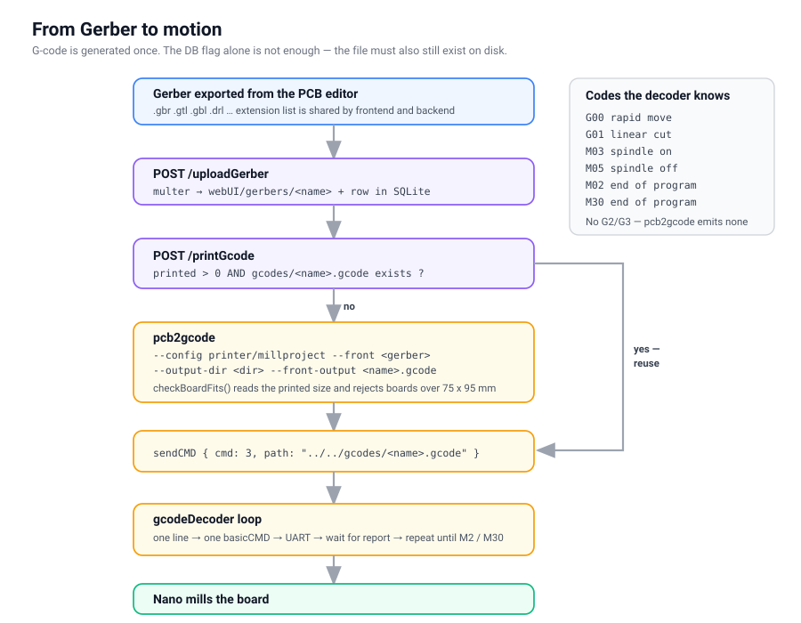
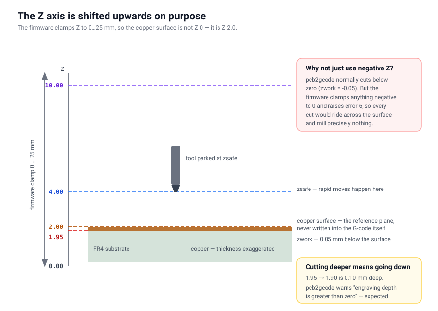

# From Gerber to motion

```txt
Gerber from the PCB editor
  -> POST /uploadGerber        -> webUI/gerbers/<name>
  -> pcb2gcode --config millproject
  -> webUI/gcodes/<name>.gcode
  -> gcodeDecoder in nanoComm
  -> basicCMD over UART
  -> Nano
```




## Generating

The backend invokes pcb2gcode through `spawn`, with arguments assembled by
`pcb2gcodeArgs()`:

```bash
pcb2gcode --config ../printer/millproject \
          --front <gerber> \
          --output-dir <dir> \
          --front-output <name>.gcode
```

The split is deliberate: **what lives in `millproject` are properties of the
machine** (cut depth, feeds, spindle rpm), **what the backend passes are
properties of the job** (which file, where to). The CLI wins over the config
file, so anything can be overridden without editing the file.

G-code is generated once. The condition is `printed > 0` in SQLite **and** the
file existing on disk — the flag alone is not enough, because the file could
have been deleted by hand.

### Board size check

`checkBoardFits()` reads the dimensions out of pcb2gcode's stdout:

```txt
Exporting front... DONE. (Height: 23.2198mm Width: 49.164mm)
```

and compares them against `machineMaxX` / `machineMaxY` (75 × 95 mm). A larger
board is stopped right there. If it were let through, the firmware would simply
clamp the coordinates, raise error 6 and produce scrap.


## The Z coordinate system

This is the most important thing in `millproject`, and it is a trick that works
around the firmware.



pcb2gcode normally uses **negative Z for cutting** — `zwork=-0.05` means
0.05 mm below the copper surface. But the firmware clamps Z to the range 0 to
`MAX_Z` and pushes anything negative up to 0 with error 6. Every cutting move
would therefore ride across the surface and mill nothing at all.

The fix: **the whole coordinate system is shifted upwards.** The copper surface
is not Z = 0, it is Z = 2.0.

| Z | Meaning |
|---|---|
| 2.00 | copper surface, the reference plane (never written anywhere) |
| 1.95 | cut depth, i.e. 0.05 mm below the surface (`zwork`) |
| 4.00 | safe height for rapid moves (`zsafe`) |
| 10.00 | tool change height (`zchange`) |

Cutting deeper means **lowering** `zwork`. From 1.95 to 1.90 is 0.10 mm deep.

pcb2gcode prints a warning for this: `Engraving depth (--zwork) is greater than
zero!`. That is expected and fine.


## Feed rate units

G-code uses **millimetres per minute** (the header contains G94), the firmware
works in **millimetres per second**. Something along the way has to divide by 60.

The division happens in `createCMD()` in nanoComm, at the `F` character:

```cpp
else if (curChar == instructionChars[5]) { cmd.speed = number / 60; }
```

**The division belongs here and nowhere else.** In particular it must not be in
`prepareForNano()`, because that function sits on the common path for every
command including manual jog from the frontend — and jog already sends mm/s.
Dividing there would make the machine crawl at 1/60 speed under manual control.

Putting it in `createCMD()` has a second benefit: the function only runs when
an `F` was actually present on the line. The `speed = -1` sentinel from the
`basicCMD` default therefore stays untouched, and the firmware still recognises
it by exact equality.

Practical effect on the current settings:

| Option | Value | mm/s |
|---|---|---|
| `mill-feed` | 200 mm/min | 3.33 |
| `mill-vertfeed` | 50 mm/min | 0.83 |


## What the decoder understands

`gcodeDecoder` in nanoComm knows:

| Code | Meaning |
|---|---|
| G00 | rapid move |
| G01 | linear cut |
| M03 | spindle on |
| M05 | spindle off |
| M02, M30 | end of program |

Instruction characters: `X Y Z I J F S`.

A few things verified against real output that are worth knowing:

**pcb2gcode ends the file with M2, not M30.** The decoder accepts both; they
mean the same thing.

**No arcs.** pcb2gcode emits neither G2 nor G3, only G00 and G01. The `I` and
`J` entries in `instructionChars` stay unused.

**The header contains codes the decoder does not know** — G94, G21, G90, G04,
T0, M0, M9. They all fall through to "unsupported" and are skipped, so nothing
breaks; they just fill the log.

**Spindle rpm is a single number for the entire job.** `S20000` appears once in
the header and never changes. Verified on `Gerber_BottomLayer.GBL.gcode`, where
it sits on line 8 and nowhere else.


## Important options in millproject

```ini
metric=true              # dimensions in this file are in mm
metricoutput=true        # output G-code is in mm
zero-start=true          # shift the board to (0,0) so no coordinate goes negative
mill-diameters=0.2       # tip diameter in mm
mill-speed=20000         # spindle rpm, the machine ceiling
isolation-width=0        # a single pass around each trace
nog64=true               # do not emit G64 — LinuxCNC can do that, we cannot
nom6=true                # do not emit M6 — we only have one tip
eulerian-paths=true      # do not mill the same path twice
tsp-2opt=true
```

`zero-start=true` is there because without it the coordinates could come out
negative depending on where the board sat in the editor — and the firmware
clamps negative X/Y to 0 with error 6.

Watch out for `optimise`: in version 2.5.0 it is **no longer** true/false but a
length (allowed deviation). The default of 0.00254 mm is on by default, so it
is not listed here. The `millproject_example` shipped with the sources still
has the old boolean form and it breaks parsing.
</content>
